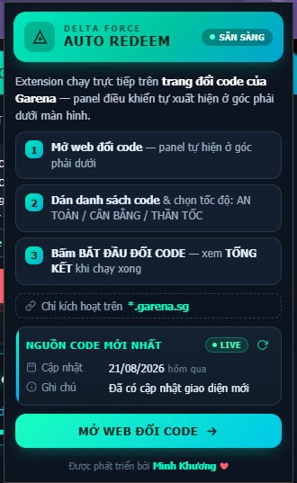
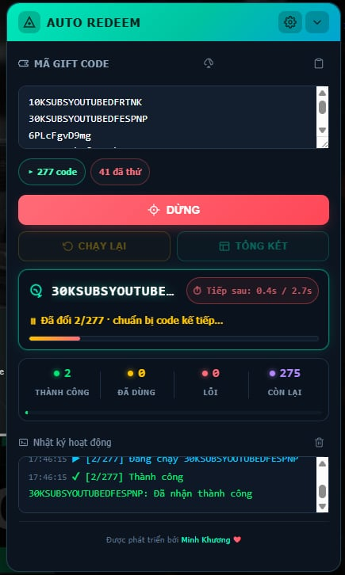
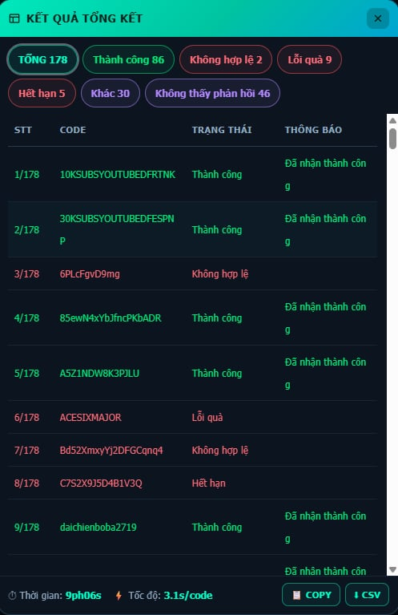
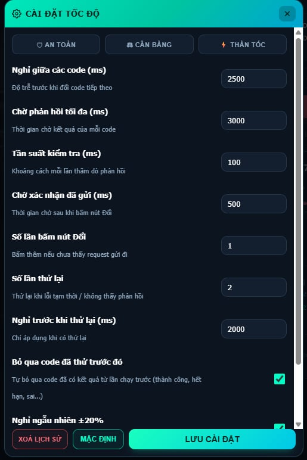

<div align="center">

# 🎯 Delta Force Auto Redeem

**Giao diện tự động đổi gift code Delta Force trên trang đổi code Garena**


Extension chèn một panel điều khiển ngay trên trang [redeem.df.garena.sg](https://redeem.df.garena.sg/) — dán danh sách code vào, bấm **BẮT ĐẦU** và mọi thứ tự chạy: nhập code, bấm Đổi, đọc phản hồi, phân loại kết quả và thống kê.

</div>

---

## ✨ Tính năng

- ⚡ **Đổi hàng loạt** — dán danh sách code (mỗi code một dòng), tự động loại trùng
- 📊 **Thống kê trực tiếp** — 4 ô THÀNH CÔNG / ĐÃ DÙNG / LỖI / CÒN LẠI + thanh tỉ lệ cập nhật real-time
- 📋 **Tổng kết chi tiết** — bảng kết quả lọc theo trạng thái, kèm **COPY ra clipboard** và **xuất CSV** (mở được bằng Excel)
- ⚙️ **3 chế độ tốc độ** — 🛡 AN TOÀN · ⚖ CÂN BẰNG · ⚡ THẦN TỐC, hoặc tinh chỉnh từng thông số
- ⏭ **Bỏ qua code đã thử** — nhớ lịch sử (tối đa 500 code) ở lần chạy sau
- 🔁 **Chạy lại thông minh** — nút CHẠY LẠI chỉ chạy lại code lỗi tạm thời / chưa chạy xong
- 🛡 **Chống rate-limit** — delay ngẫu nhiên ±20%, tự backoff lũy tiến khi bị giới hạn tốc độ
- ☁️ **Tải code từ nguồn** — một nút kéo danh sách code mới nhất từ GitHub về ô nhập
- 🔔 **Báo khi hoàn tất** — tiếng beep + nhấp nháy tiêu đề tab
- 🆕 **Tự kiểm tra bản cập nhật** — mỗi 6 giờ, hiện banner + badge `!` trên icon khi có bản mới

## 📸 Hình ảnh

| Popup extension | Panel trên trang đổi code |
| :---: | :---: |
|  |  |

| Modal tổng kết + COPY/CSV | Cài đặt tốc độ |
| :---: | :---: |
|  |  |

## 📥 Cài đặt

> Yêu cầu trình duyệt nhân Chromium **từ 111 trở lên** (Chrome, Edge, Brave, ...).

### Bước 1 — Lấy mã nguồn

**Cách A — Tải ZIP (dễ nhất):**
1. Bấm nút **Code** (màu xanh) → **Download ZIP** ở góc phải trang repo này
2. Giải nén ra một thư mục cố định (VD: `D:\AutoRedeemDF`) — **đừng xoá thư mục này sau khi cài**, extension chạy trực tiếp từ đây

**Cách B — Dùng Git:**
```bash
git clone https://github.com/minhkhw/AutoRedeemDF.git
```

### Bước 2 — Nạp extension vào trình duyệt

1. Mở `chrome://extensions` (Edge: `edge://extensions`, Brave: `brave://extensions`)
2. Bật **Developer mode** (Chế độ nhà phát triển) — góc phải
3. Bấm **Load unpacked** (Tải tiện ích đã giải nén) → chọn thư mục vừa giải nén/clones
4. (Tuỳ chọn) Ghim extension lên thanh công cụ để dễ thấy badge cập nhật

### Bước 3 — Chạy

1. Mở [redeem.df.garena.sg](https://redeem.df.garena.sg/) và **đăng nhập tài khoản Garena**
2. Panel **AUTO REDEEM** tự xuất hiện ở góc phải dưới màn hình
3. Dán danh sách code → chọn tốc độ → bấm **BẮT ĐẦU**

## 🚀 Sử dụng

### Quy trình cơ bản

1. **Nhập code** — dán tay, bấm nút 📋 (dán từ clipboard), hoặc bấm nút ☁️ (tải từ nguồn GitHub)
2. **Bấm BẮT ĐẦU** — theo dõi card "đang chạy" (code hiện tại + đồng hồ đếm), 4 ô thống kê và nhật ký
3. **Xem TỔNG KẾT** — bấm vào từng pill trạng thái để lọc, rồi COPY hoặc tải CSV
4. Nếu có code lỗi tạm thời → bấm **CHẠY LẠI** (chỉ chạy lại các code đáng thử lại)

### Cài đặt tốc độ

| Chế độ | Nghỉ giữa các code | Chờ phản hồi | Thử lại khi lỗi | Phù hợp |
| :--- | :--- | :--- | :--- | :--- |
| 🛡 **AN TOÀN** | 2500ms | 3000ms | 2 lần | Đang bị rate-limit, muốn chắc chắn |
| ⚖ **CÂN BẰNG** | 1000ms | 2000ms | 0 | Mặc định, dùng hằng ngày |
| ⚡ **THẦN TỐC** | 300ms | 1200ms | 0 | Sự kiện mở code mới, cần tốc độ |

Các thông số đều chỉnh tay được trong ⚙ **Cài đặt** (kéo panel → biểu tượng bánh răng).

### Định dạng file nguồn code (`code.json`)

Nút ☁️ trên panel tải `code.json` từ repo này, rồi tải tiếp danh sách code từ URL trong file. Nếu bạn muốn tự host nguồn code cho nhóm của mình, giữ đúng định dạng:

```json
{
  "url": "https://link-toi-file-danh-sach-code.txt",
  "updated": "22/08/2026",
  "note": "Gift code sự kiện tháng 8"
}
```

- `url` — trỏ tới file text, **mỗi code một dòng**
- `updated` — ngày cập nhật (định dạng `DD/MM/YYYY` để hiện "x ngày trước")
- `note` — ghi chú hiển thị trong popup

## ❓ FAQ

<details>
<summary><b>Panel không hiện trên trang đổi code?</b></summary>

- Kiểm tra bạn đang ở địa chỉ `*.garena.sg` (mở đúng [redeem.df.garena.sg](https://redeem.df.garena.sg/))
- Extension đã được bật ở `chrome://extensions`?
- Thử F5 trang. Nếu vẫn không thấy, Chrome của bạn có thể dưới phiên bản 111 — cần nâng cấp (extension dùng chế độ chạy MAIN world của content script)
</details>

<details>
<summary><b>Popup hiện "CHƯA SẴN SÀNG"?</b></summary>

Badge này chỉ có nghĩa là tab hiện tại không phải trang `*.garena.sg`. Mở trang đổi code là extension sẵn sàng.
</details>

<details>
<summary><b>Vì sao một số code bị "Đã bỏ qua"?</b></summary>

Tính năng **"Bỏ qua code đã thử trước đó"** đang bật — extension nhớ các code đã có kết quả (thành công, hết hạn, sai...) từ lần chạy trước nên tự nhảy qua cho đỡ mất thời gian. Muốn chạy lại: mở ⚙ Cài đặt → tắt tùy chọn này, hoặc bấm **XOÁ LỊCH SỬ**.
</details>

<details>
<summary><b>Bị "Lỗi tạm thời" / giới hạn tốc độ nhiều?</b></summary>

Chuyển sang chế độ 🛡 **AN TOÀN**, bật tùy chọn **"Nghỉ ngẫu nhiên ±20%"**. Extension cũng đã tự động nghỉ gấp đôi mỗi lần bị rate-limit (tối đa 10 giây).
</details>

<details>
<summary><b>"Không thấy phản hồi" là gì?</b></summary>

Trang trả kết quả chậm hơn thời gian chờ cài đặt. Tăng **"Chờ phản hồi tối đa"** lên 3000–5000ms trong ⚙ Cài đặt, hoặc tăng **"Số lần thử lại"**. Các code này luôn nằm trong danh sách CHẠY LẠI.
</details>

<details>
<summary><b>Kết quả "Cần xác minh" (captcha)?</b></summary>

Garena yêu cầu xác minh người dùng. Hãy tự tay hoàn thành captcha trên trang rồi chạy lại — đây là cơ chế bảo vệ của Garena, extension không (và không nên) tự vượt.
</details>

<details>
<summary><b>Dữ liệu của tôi được lưu ở đâu?</b></summary>

Toàn bộ cài đặt và lịch sử code nằm trong `localStorage` của trang `garena.sg` **ngay trên máy bạn** — không có server, không gửi dữ liệu đi đâu. Gỡ extension hoặc xoá dữ liệu trang là sạch.
</details>

<details>
<summary><b>Làm sao cập nhật extension?</b></summary>

Extension tự so sánh phiên bản với repo mỗi 6 giờ — khi có bản mới sẽ hiện banner vàng trong panel/popup và badge `!` trên icon. Khi đó:

1. Tải bản mới từ repo (ZIP hoặc `git pull`) và ghi đè thư mục cũ
2. Vào `chrome://extensions` → bấm icon **↻** (Reload) trên card extension
3. F5 lại trang đổi code
</details>

## 🔒 Quyền riêng tư & quyền truy cập

Extension **không thu thập** thông tin cá nhân, không có analytics, không gửi dữ liệu đi đâu. Các quyền trong `manifest.json` chỉ phục vụ tính năng:

| Quyền | Mục đích |
| :--- | :--- |
| `activeTab` | Đọc địa chỉ tab hiện tại để hiện trạng thái SẴN SÀNG / CHƯA SẴN SÀNG |
| `alarms` | Hẹn giờ kiểm tra bản cập nhật mỗi 6 giờ |
| `storage` | Lưu kết quả kiểm tra phiên bản gần nhất |
| `raw.githubusercontent.com` | Tải danh sách code (`code.json`) và manifest để kiểm tra cập nhật |

Cơ chế hoạt động: extension mô phỏng đúng thao tác tay (nhập code vào ô, bấm nút Đổi) trên trang đổi code, đồng thời đọc phản hồi của chính trang đó để phân loại kết quả — không can thiệp gì khác vào tài khoản của bạn.

## 🗂 Cấu trúc dự án

| File | Vai trò |
| :--- | :--- |
| `manifest.json` | Khai báo extension (Manifest V3) |
| `content.js` | Panel UI + logic đổi code — chạy trong MAIN world của trang |
| `proxy.js` | Cầu nối `chrome.runtime` (ISOLATED world): nút tải code, kiểm tra cập nhật |
| `background.js` | Service worker: fetch nguồn code, kiểm tra bản cập nhật |
| `popup.html` / `popup.js` | Popup: trạng thái, nguồn code mới nhất, banner cập nhật |
| `code.json` | Nguồn danh sách code được extension tải về |
| `icons/` | Icon các kích thước |

## 📝 Cập nhật

- **v1.3** — Sửa lỗi nút tải code khi panel khởi tạo chậm; hết kẹt nút DỪNG nếu chạy lỗi giữa chừng; luôn trả lại hook fetch/XHR cho trang; thêm COPY/CSV trong Tổng kết
- Các bản trước — xem [lịch sử commit](https://github.com/minhkhw/AutoRedeemDF/commits/main)

## 👨‍💻 Tác giả

Được phát triển bởi **Minh Khương** ❤

Nếu thấy hữu ích, hãy ⭐ repo này và chia sẻ cho đồng đội!

## 📄 Giấy phép

Dự án phát hành theo giấy phép [MIT](LICENSE).
